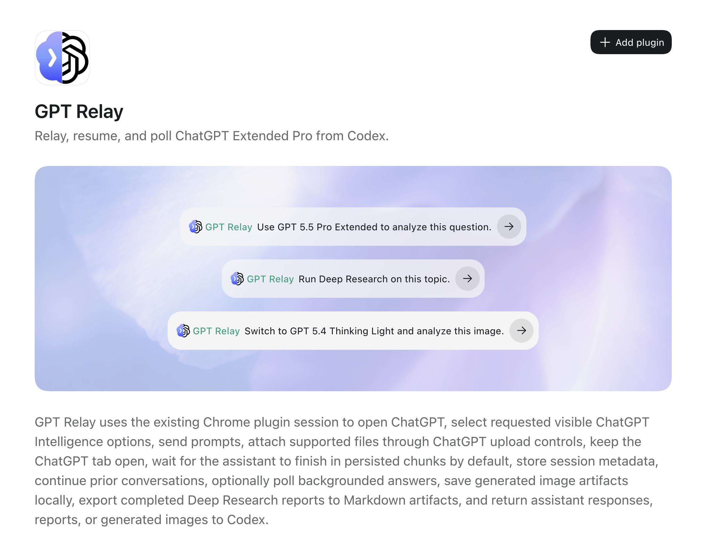

# GPT Relay Codex Plugin

[中文说明](./README.zh-Hant.md) | [English details](./README.en.md)

GPT Relay is a Codex plugin that relays prompts from Codex to ChatGPT through your existing Chrome session, then returns the completed ChatGPT response, generated images, Deep Research reports, and conversation links back to Codex.

It is designed for users who want Codex to ask ChatGPT with visible ChatGPT Intelligence options such as GPT 5.5 Pro Extended, GPT 5.4 Thinking Light, Deep Research, web search, image generation, and file uploads.

> This is an independent community plugin by Prompt Case. It is not an official OpenAI or ChatGPT product.

## Demo

### Codex Install Screen



### Codex and ChatGPT Side-by-Side

The demo below shows Codex calling GPT Relay while Chrome opens ChatGPT, switches the requested visible model/mode/effort, sends the prompt, and returns the result.


## Install

### Option A: Install From The Codex UI

In Codex, open **Plugins** → **Manage** → **Create** → **Add marketplace**, then fill in:

| Field | Value |
| --- | --- |
| Source | `ChingFuHan/My_relay_test` |
| Git ref | `main` |
| Sparse paths | Leave blank for the normal install. Optionally use `.agents/plugins` and `plugins/gpt-relay` if your Codex build asks for sparse checkout paths. |

After adding the marketplace, install **GPT Relay**, then start a new Codex thread.

### Option B: Add The Marketplace From The CLI

Run this command in your Codex environment:

```bash
codex plugin marketplace add ChingFuHan/My_relay_test --ref main
codex plugin add gpt-relay@gpt-relay-host-bridge
```

Then install **GPT Relay** from the Codex Plugins UI and start a new Codex thread.

## Chrome Setup

The direct browser-provider path needs the official Codex Chrome extension. The `host-bridge` path
uses Chrome CDP and does not require that extension for ordinary text relay.

### Install The Codex Chrome Extension

Install the official Codex extension from the Chrome Web Store:

[Codex on Chrome Web Store](https://chromewebstore.google.com/detail/codex/hehggadaopoacecdllhhajmbjkdcmajg)


### Enable File Uploads

If you want GPT Relay to upload local files or images to ChatGPT, enable file URL access for the Codex Chrome extension:

1. Open Chrome **Manage Extensions**.
2. Open **Details** for the Codex extension.
3. Turn on **Allow access to file URLs**.


## Requirements

- Codex with plugin support.
- Either the official Codex Chrome extension, or the `host-bridge` setup in this repo.
- A logged-in ChatGPT session in Chrome.
- **Allow access to file URLs** enabled if you want GPT Relay to upload local attachments.
- Your ChatGPT account must have access to the model or mode you request. For example, Pro mode requires a ChatGPT Pro account.

## Host-Bridge Path

If Codex cannot directly use the Chrome session that already has ChatGPT logged in, use the host-bridge path in this repo.

Common cases:

- Codex and Chrome are on the same machine, but you want a dedicated bridge
- Codex runs in a VM, Docker container, WSL instance, or dev container
- Codex runs on a different machine from the Chrome session you want to use

Start here:

- [user_quick_start.md](./user_quick_start.md)
- [docs/README.md](./docs/README.md)
- [docs/deployment-modes.md](./docs/deployment-modes.md)
- [docs/global_codex_setup.md](./docs/global_codex_setup.md)
- [host-bridge/README.md](./host-bridge/README.md)

## Use In Every Codex Session

To make the relay available from any directory, install the plugin, shell environment, and native
Codex slash prompts once:

```bash
bash scripts/install-global-codex-relay.sh \
  --bridge-url http://192.168.0.72:8765 \
  --bridge-token 'change-me'
```

Then open a new terminal and Codex thread anywhere, and use:

```text
/prompts:chatgpt <task for ChatGPT>
```

See [docs/global_codex_setup.md](./docs/global_codex_setup.md) for the complete setup and
[docs/new-codex-session.md](./docs/new-codex-session.md) for daily use.

## Marketplace Package

This repository is structured as a Codex plugin marketplace source. Codex needs:

- `.agents/plugins/marketplace.json` at the repository root.
- `plugins/gpt-relay/.codex-plugin/plugin.json`.
- The plugin source folder at `plugins/gpt-relay`.
- A valid Git ref, normally `main`.

The Codex **Add marketplace** dialog adds this repository as a custom marketplace source. It is different from publishing to an official built-in OpenAI marketplace.

## What It Can Do

- Keep your current ChatGPT Intelligence selection when you do not request a model change.
- Switch visible ChatGPT Intelligence options when requested, such as `5.5 Pro Extended` or `5.4 Thinking Light`.
- Refuse clearly when the requested option is not visible in your account, instead of silently falling back to another model.
- Send prompts and supported file attachments to ChatGPT.
- Return ChatGPT replies as normal Markdown, preserving headings, lists, tables, links, and code blocks where possible.
- Return generated images as local image artifacts.
- Export completed Deep Research reports to Markdown artifacts.
- Keep session metadata so you can continue or poll long-running ChatGPT tasks.

## Example Prompts

```text
Use GPT 5.5 Pro Extended to analyze this question: ...
```

```text
Run Deep Research on this topic: ...
```

```text
Switch to GPT 5.4 Thinking Light and analyze this image.
```

## Update

To update the marketplace source later:

```bash
codex plugin marketplace upgrade gpt-relay-host-bridge
```

Update or reinstall **GPT Relay** from the Codex Plugins UI, then start a new Codex thread.

## Notes

- GPT Relay operates through the visible ChatGPT web UI. If ChatGPT changes its UI, selectors may need updates.
- The plugin reports the visible model/mode/effort selected in ChatGPT. It does not claim hidden backend state.
- It will stop on login prompts, CAPTCHA, permission dialogs, or unavailable account features.
